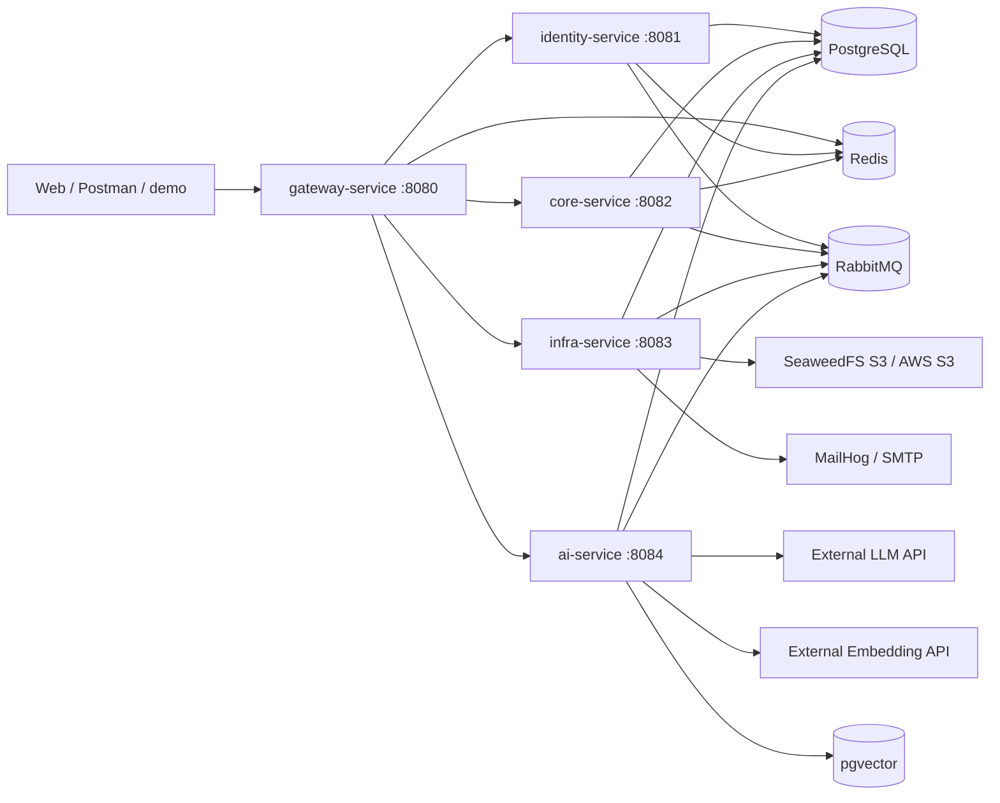

# 架构

## 服务拓扑

## 所有权和调用边界

| 数据/能力 | 真源 | 协作方式 |
|---|---|---|
| 登录邮箱、密码哈希、refresh/reset token | identity | `identity.user.*` 事件投影到 `core.user_directory` |
| Workspace、Project、Member、Issue、Comment | core | 对外 API；领域事件通知 infra/ai |
| 文件元数据、对象、通知、邮件、导出任务 | infra | core 内部权限 API；S3；MQ |
| AI 会话、usage、索引任务、向量 | ai/rag | core 内部上下文 API；MQ；外部模型 API |

内部 HTTP 使用 `X-Internal-Token`，外部客户端不能通过 Gateway 访问 `/internal/**`。Gateway 删除客户端伪造的身份 Header，验证 JWT 后重建 `X-User-Id`、`X-Username` 和角色上下文。

## 同步与异步路径

同步路径用于需要即时结果或权限判断的操作。跨服务副作用使用版本化 MQ 事件：业务事务先写 Local Outbox，提交后尝试发布，调度器补偿失败记录。消费者先登记 `eventId`，再与投影更新同事务提交；有限重试耗尽后进入 DLQ。

RAG 只做增量索引。检索前先调用 core 做权限校验，查询层同时使用 `workspaceId` 和 `projectId` metadata filter。AI 返回建议，不写 core 业务表。
