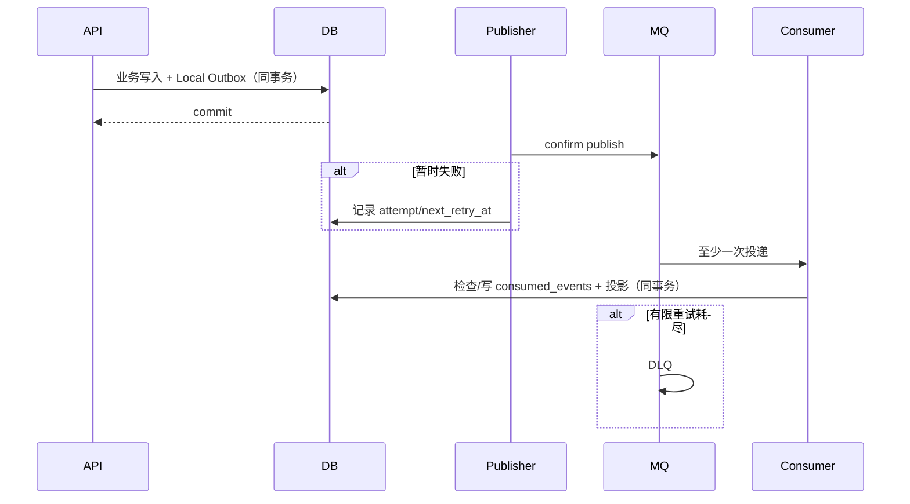

# MQ、Outbox 与消费幂等

RabbitMQ 使用 vhost `liteworkflow_backend`。事件 envelope 包含 `eventId`、`eventType`、`version`、`occurredAt`、`scope`、aggregate 标识和精简 payload；禁止包含密码、Token、完整评论/文件正文、Prompt 或 embedding。

## MVP 事件族

| 生产者 | 事件 | 主要消费者/用途 |
|---|---|---|
| identity | `identity.user.registered`, `identity.user.updated`, `identity.user.disabled` | core 更新 `user_directory`，按 source version 拒绝旧事件 |
| core | `workspace.member.*`, `project.member.*` | infra 站内通知与邮件 |
| core | Issue 分配/状态、Comment mention | infra 通知/邮件；ai 增量索引 |
| core | Issue/Comment RAG source 变化 | ai 创建/更新/软失效向量 |
| infra | `rag.document.index` / 文档删除、版本变化 | ai 下载对象、抽取、切片、索引 |
| infra | export request | core 按批次生成 CSV/XLSX 并回写对象/状态事件 |

实际 exchange、routing key、queue 和 DLQ 常量以各服务的 `*AmqpConfiguration` 为事实来源。

## 可靠性流程

业务提交不依赖 RabbitMQ 当时可用。重复事件必须无副作用；乱序用户事件按版本拒绝覆盖。排障时先看 outbox backlog、queue depth、consumer 日志和 DLQ，不要手工删除尚未确认业务状态的事件。
